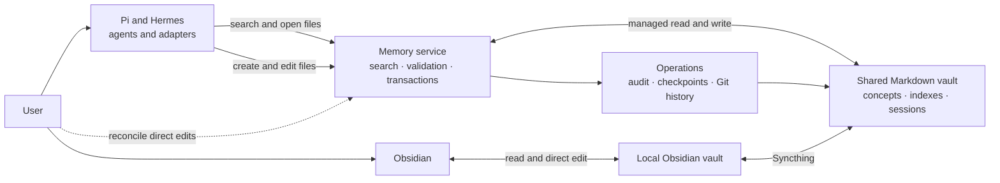

# Core module architecture

The project has two access paths to one shared Markdown vault: agents use the managed memory service, while the user reads and edits through Obsidian.

Agent changes pass through the memory service for validation, auditing, and Git history. Obsidian edits synchronize directly and enter managed history when the user runs `memory reconcile`.
