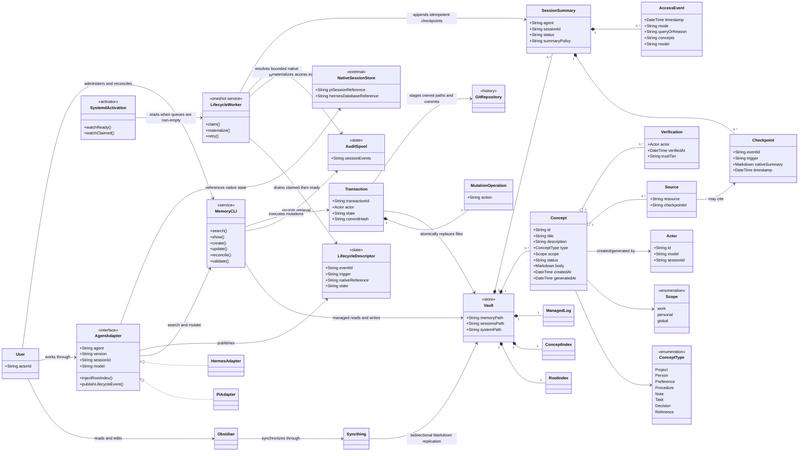

# High-Level UML

This diagram summarizes the main domain entities and system boundaries from the product and technical specifications. Markdown in the shared vault is authoritative; queues, transaction state, audit spools, and native agent stores remain outside it.

